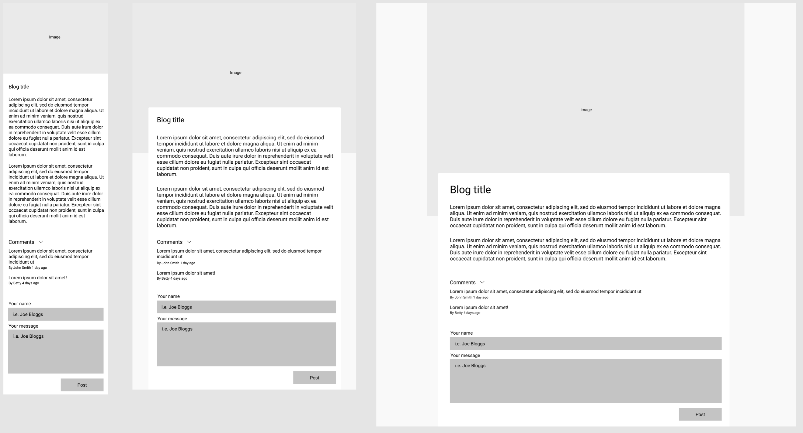

# React Recruitment Task

## The task

Your task, should you choose to accept it, is to develop a simple blog with the ability to search and filter posts, and view / add comments. Application must be a SPA and use multiple routes (defined below)

## Tech stack

- API: [JSON Placeholder](https://jsonplaceholder.typicode.com)
- Starter: [create-react-app](https://github.com/facebook/create-react-app)
- Routing: [React Router](https://github.com/ReactTraining/react-router)
- State Management: [Context API](https://reactjs.org/docs/context.html)

## Screens

- `Blog` (mobile / tablet / desktop views)
  
  - List of blog posts
  - For each blog posts you must display title, date and # of comments
  - On user click you will navigate to `Blog Post` page
- `Blog Post` (mobile / tablet / desktop views)
  
  - On the top of this page you will have the image, enlarged (consider srcset here)
  - Blog title
  - Full blog content
  - Blog post comments
    - Comment
    - Author and relative date time
  - Add blog post comment
    - Author name
    - Comment
    - Button that saves the comment via API and add Comment to the list

## Must-haves

- React
- Connection with API
- Usage of React Router for multiple pages
- Loaders for when you wait for the data
- Validation on any forms
- Usage of modern JS functionality (ES6+)

## Good to haves

- Clean code (linters, prettier)
- UI kit for styled components (whether off the shelf or self developed, though bonus points if self developed)
- Tests
- App deployed to [Heroku](https://www.heroku.com/) or [Netlify](https://www.netlify.com/)

## What we'll be paying attention to

1. How you organise your code
2. How you store & manage state
3. Reusability of components
4. Code repititions and reusability (keep your code [DRY](https://en.wikipedia.org/wiki/Don%27t_repeat_yourself) and [KISS](https://en.wikipedia.org/wiki/KISS_principle))
5. How and where you place your business logic
6. Code optimisation and overall solution performance
7. Working in accordance with best practice in general
8. How you communicate with the API
9. Handling unexpected errors or potential exceptions
